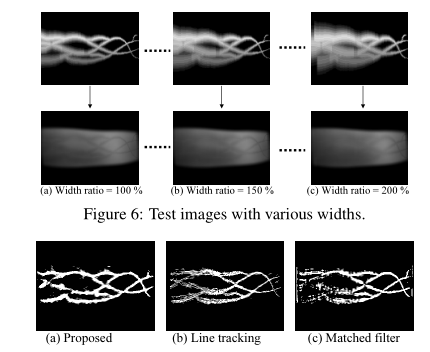

# LMC_FingerVein

This repository is a **PyTorch** implementation of LMC [doi](https://dl.acm.org/doi/10.5555/1522515.1522524)):

> Extraction of Finger-Vein Patterns Using Maximum Curvature Points in Image Profiles



### Files in the folder

- `data/`
  - origin/
    - sample.bmp
  - result/
    - result.bmp
- `code/`: implementations of LMC

### Required packages

The code has been tested running under Python 3.6, with the following packages installed (along with their dependencies):

- pytorch >= 1.0
- numpy >= 1.14.5
- scipy >= 1.5.4 
- matplotlib >= 3.3.0


### Running the code

```shell
$ cd code
$ python main.py
```

